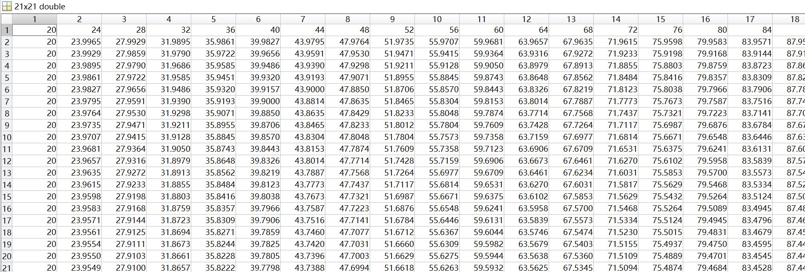

<center><font size="6"><b>CFD作业4</b></font></center>

<center><font size="3"><b>林文浩 PB21050974</b></font></center>

#### 方程公式推导

二维扩散方程表示为

$\frac{\partial u}{\partial t}=\sigma_x\frac{\partial^2u}{\partial^2x}+\sigma_y\frac{\partial^2u}{\partial^2y}$

本题中

$\sigma_x=\sigma_y=\sigma$

因此方程简化成

$\frac{\partial u}{\partial t}=\sigma(\frac{\partial^2u}{\partial^2x}+\frac{\partial^2u}{\partial^2y})$

交替方向隐式方法（Alternating Diretion Implicit, ADI）可以表示为以下两个式子

1式：$\frac{u^*_{ij}-u^n_{ij}}{\Delta t/2} = \sigma_x\frac{\delta_x^2u_{ij}^*}{\Delta^2x}+\sigma_y\frac{\delta_y^2u_{ij}^n}{\Delta^2y}$，$u^*_{ij}$为未知量

2式：$\frac{u^{n+1}_{ij}-u^*_{ij}}{\Delta t/2} = \sigma_x\frac{\delta_x^2u_{ij}^*}{\Delta^2x}+\sigma_y\frac{\delta_y^2u_{ij}^{n+1}}{\Delta^2y}$，$u^{n+1}_{ij}$为未知量

其中$\delta_x^2=E^1_x-2I+E^{-1}_x$，$\delta_y^2=E^1_y-2I+E^{-1}_y$

在本题中$\Delta x=\Delta y,\sigma_x=\sigma_y=\sigma$，令$\frac{\sigma\Delta t}{2\Delta^2x}=\frac{\sigma\Delta t}{2\Delta^2y}=\lambda$，两式子分别简化为

3式：$(1+2\lambda)u^*_{ij}-\lambda u^*_{i+1,j}-\lambda u^*_{i-1,j}=(1-2\lambda)u^n_{ij}+\lambda u^n_{i,j+1}+\lambda u^n_{i,j-1}$

4式：$(1+2\lambda)u^{n+1}_{ij}-\lambda u^{n+1}_{i,j+1}-\lambda u^{n+1}_{i,j-1}=(1-2\lambda)u^*_{ij}+\lambda u^*_{i+1,j}+\lambda u^*_{i-1,j}$

对于边界条件，以$u^*_{ij}$为例，如果简单地令$u^*_{ij}=u^{n+\frac12}_{ij}$，则只能得到一阶精度，用上方1式减去2式，得到表达式5式

5式：

$u^*_{ij}=\frac{u^n_{ij}+u^{n+1}_{ij}}{2}-\frac12\lambda\delta^2_y(u^n_{ij}-u^{n+1}_{ij})$

$=\frac12[(1-2\lambda)u^n_{ij}+(1+2\lambda)u^{n+1}_{ij}+\lambda(u^n_{i,j-1}+u^n_{i,j+1}-u^{n+1}_{i,j-1}+u^{n+1}_{i,j+1})]$

利用该式子作为边界条件则能够获得二阶精度

##### 运算过程

1. 初始化三个对应网格点的矩阵u、u\_和u\_t，u即为所求的网格上的数值解，u\_表示u\*，即计算过程中的中间变量，u\_t用于临时存放下一时刻的u的边界值，这是因为u\*的求解需要用到t时刻和t+$\Delta t$时刻的u的值。初始化其他参数（比如$\sigma$、网格间距、时间步长等）。

2. 开始一个大循环while直到 t 到达指定的终止时刻 t_end 才结束，每循环一次表示一次完整的推演，下面所有步骤都在大循环里进行

3. 由表达式直接计算下一时刻的边界，结果暂时不存入 u 而是存入 u_t 中
4. 通过__5式__计算左右边界（不包括四个角）的u\*边界条件（上下边界包括四个角求不出来，也用不到）
5. 利用步骤4得到的 u\* 边界和__3式__计算内部区域的 u*(u_)，这是一个三对角方程组，用追赶法求解
6. 计算下一时刻边界的 u （其实已经算过了，直接从u_t里复制过来就行）
7. 计算下一时刻内部的 u ，利用步骤6得到的边界和__4式__，也是一个三对角方程组，用追赶法求解

#### 计算结果

(1)如__方程公式推导__部分所示

(2)以下结果均为在时间步长0.01（数值解），终止时刻 1 的条件下得到的

$\Delta x=0.1$数值解

<center class = "half">
    
</center>

$\Delta x=0.1$解析解

<center class = "half">
    
</center>

$\Delta x=0.05$数值解(部分结果)

<center class = "half">
    
</center>

$\Delta x=0.05$解析解(部分结果)

<center class = "half">
    
</center>

$\Delta x=0.025$数值解(部分结果)

<center class = "half">
    
</center>

$\Delta x=0.025$解析解(部分结果)

<center class = "half">
    
</center>

可以看到数值解和解析解的误差在0.001量级

(3)同样采用0.01的时间步长，在t=2时数值误差$\epsilon(2)$和网格间距的关系如下图（xy轴均对2取对数）

可以发现，在$\Delta x$较大的时候，$log_2\epsilon(2)$与$log_2\Delta x$成线性关系，斜率大约为2，这是因为该方法是O($n^2$)，的，而当$\Delta x$较小的时候，不再成线性关系，但是总体趋势还是随着网格间距减小而精度增加。，推测可能的原因为此时由于网格大小带来的误差已经非常小，主要精度受限于时间步长和浮点数运算精度。

<center class = "half">
    
</center>

<center class = "half">
    
</center>

(4)采用0.01的时间步长，计算误差 $log_{10}E_h$ 随 t 的变化关系如下图，可以发现它们的关系呈线性变化

<center class = "half">
    
</center>

#### matlab源码

##### adi.m

```matlab
% 二维扩散方程 ut = sigma * (uxx + uyy)
% 交替方向隐式方法（Alternating Diretion Implicit, ADI）

function u = adi(delta_x, t_end)
    % 初始化
    Lx = 1;
    Ly = Lx;
    sigma = 1;
    delta_t = 0.01; % 时间步长
    t = 0;
    n = round(Lx / delta_x, 0) + 1; % 网格数四舍五入到小数点后0位，取整
    lambda = sigma * delta_t / (2 * delta_x ^ 2); % 仅用于简化表达式，无实际含义
    %delta_x = input("输入网格间距(x和y的相同)\n"); % 空间步长
    %delta_y = delta_x;
    %t_end = input("输入最终时刻\n");

    % 初始条件（包含初始边界条件）
    u = zeros(n);

    for i = 1:n

        for j = 1:n
            x = ((i - 1) / (n - 1)) * Lx;
            y = ((j - 1) / (n - 1)) * Ly;
            u(i, j) = 20 + 80 * (y - exp(-0.5 * sigma * pi ^ 2 * t) * sin(pi / 2 * x) * sin(pi / 2 * y));
        end

    end

    u_ = zeros(n); % 表示u*
    u_t = zeros(n); % 用于暂时存储t + delta_t时刻u的边界值，在计算u*（即u_）的边界时会用到

    while t < t_end -1e-6
        % 计算下一时刻的边界，结果暂时不存入u而是存入u_t中
        for j = 1:n
            y = ((j - 1) / (n - 1)) * Ly;
            u_t(1, j) = boundaryLeft(y, t + delta_t, sigma);
            u_t(n, j) = boundaryRight(y, t + delta_t, sigma);
        end

        for i = 1:n
            x = ((i - 1) / (n - 1)) * Lx;
            u_t(i, 1) = boundaryDown(x, t + delta_t, sigma);
            u_t(i, n) = boundaryUp(x, t + delta_t, sigma);
        end

        % 计算左右边界（不包括四个角）的u*边界条件（上下边界包括四个角求不出来，也用不到）
        for j = 2:n - 1
            u_(1, j) = 0.5 * ((1 - 2 * lambda) * u(1, j) + (1 + 2 * lambda) * u_t(1, j) + ...
                lambda * (u(1, j - 1) + u(1, j + 1) - u_t(1, j - 1) - u_t(1, j + 1)));
            u_(n, j) = 0.5 * ((1 - 2 * lambda) * u(n, j) + (1 + 2 * lambda) * u_t(n, j) + ...
                lambda * (u(n, j - 1) + u(n, j + 1) - u_t(n, j - 1) - u_t(n, j + 1)));
        end

        % 计算内部区域的u*(u_)
        for j = 2:n - 1
            d = repmat(1 + 2 * lambda, n, 1); % 主对角线上的元素
            e = repmat(-lambda, n, 1); % 上对角线上的元素
            f = repmat(-lambda, n, 1); % 下对角线上的元素
            d(1) = 1;
            d(n) = 1;
            e(1) = 0;
            f(n) = 0;
            b = zeros(n, 1); % 右侧向量
            b(1) = u_(1, j);
            b(n) = u_(n, j);

            for i = 2:n - 1
                b(i) = (1 - 2 * lambda) * u(i, j) + lambda * u(i, j + 1) + lambda * u(i, j - 1);
            end

            u_(:, j) = trisolve(f, d, e, b); % 解三对角方程，返回的结果直接存回u_里
            % 虽然返回的结果是*u1j、u*2j...u*nj 在几何坐标系中是一行，但是在矩阵表示中是一列
        end

        % 计算下一时刻边界的 u （其实已经算过了，直接从u_t里复制过来就行）
        for j = 1:n
            u(1, j) = u_t(1, j);
            u(n, j) = u_t(n, j);
        end

        for i = 1:n
            u(i, 1) = u_t(i, 1);
            u(i, n) = u_t(i, n);
        end

        % 计算下一时刻内部的 u
        for i = 2:n - 1
            d = repmat(1 + 2 * lambda, n, 1); % 主对角线上的元素
            e = repmat(-lambda, n, 1); % 上对角线上的元素
            f = repmat(-lambda, n, 1); % 下对角线上的元素
            d(1) = 1;
            d(n) = 1;
            e(1) = 0;
            f(n) = 0;
            b = zeros(n, 1); % 右侧向量
            b(1) = u(i, 1);
            b(n) = u(i, n);

            for j = 2:n - 1
                b(j) = (1 - 2 * lambda) * u_(i, j) + lambda * u_(i - 1, j) + lambda * u_(i + 1, j);
            end

            u(i, :) = (trisolve(f, d, e, b))'; % 解三对角方程，返回的结果直接存回u里
            % 虽然返回的结果是ui1、ui2...uin 在几何坐标系中是一列，但是在矩阵表示中是一行
        end

        % 更新当前时刻
        t = t + delta_t;
    end

end

% u 的边界条件：
function u = boundaryLeft(y, ~, ~)
    u = 20 + 80 * y;
end

function u = boundaryRight(y, t, sigma)
    u = 20 + 80 * (y - exp(-0.5 * sigma * pi ^ 2 * t) * sin(pi / 2 * y));
end

function u = boundaryDown(~, ~, ~)
    u = 20;
end

function u = boundaryUp(x, t, sigma)
    u = 20 + 80 * (1 - exp(-0.5 * sigma * pi ^ 2 * t) * sin(pi / 2 * x));
end

% 追赶法 LU分解 解三对角方程组，其中abcf分别为下对角线、主对角线、上对角线和右侧向量
% abcf的长度均需要为n，即使a和c本质维度是n-1，a[0]和c[n]不作使用
function x = trisolve(a, b, c, f)
    % 创建辅助数组和结果向量
    n = length(a);
    Beta = zeros(1, n);
    Gamma = zeros(1, n);
    Delta = zeros(1, n);
    y = zeros(1, n);
    x = zeros(n, 1);

    % 三角分解:Ax=f ---> (LU)x = f
    Gamma(1) = b(1);
    Delta(1) = c(1) / Gamma(1);

    for i = 2:n

        Beta(i) = a(i);
        Gamma(i) = b(i) - Beta(i) * Delta(i - 1);

        if i ~= n
            Delta(i) = c(i) / Gamma(i);
        end

    end

    % Ly = f
    y(1) = f(1) / Gamma(1);

    for i = 2:n
        y(i) = (f(i) - Beta(i) * y(i - 1)) / Gamma(i);
    end

    % Ux = y
    x(n) = y(n);

    for i = n - 1:-1:1
        x(i) = y(i) - Delta(i) * x(i + 1);
    end

end

```

##### analytical_solution.m

```matlab
% 本题的解析解，用于对比

function u = analytical_solution(delta_x, t)
    
    % 参数
    Lx = 1;
    Ly = Lx;
    sigma = 1;
    n = round(Lx / delta_x, 0) + 1; % 网格数四舍五入到小数点后0位，取整

    % 网格上的解析解
    u = zeros(n);

    for i = 1:n

        for j = 1:n
            x = ((i - 1) / (n - 1)) * Lx;
            y = ((j - 1) / (n - 1)) * Ly;
            u(i, j) = 20 + 80 * (y - exp(-0.5 * sigma * pi ^ 2 * t) * sin(pi / 2 * x) * sin(pi / 2 * y));
        end

    end
end

```

##### result_analysis1.m

```matlab
% 用于分析adi方法计算的结果

% 定义数值误差 epsilon(t) = ||u(t) - u'(t)|| 即数值解和解析解的最大误差
% 求epsilon(2)和网格间距的关系（使用对数坐标系）即log(epsilon) ~ log(h)
% 为了方便去log，直接定义网格间距为1/2、1/4、1/8、1/16... 以底数为2取log后，变成-1、-2、-3、-4....

n = 10;
t = 2;
x_plot = zeros(1,n);
y_plot = zeros(1,n);

for i = 1 : n
    delta_x = 1 / 2^i;
    u = analytical_solution(delta_x, t);
    u_ = adi(delta_x, t);
    max = 0;
    for j = 1 : 2^i + 1
        for k = 1 : 2^i + 1
            if max < abs(u(j, k) - u_(j, k))
                max = abs(u(j, k) - u_(j, k));
            end
        end
    end
    x_plot(i) = -i;
    y_plot(i) = log(max) / log(2);
end

plot(x_plot, y_plot);
xlabel('log_2 \Delta_x');
ylabel('log_2 \epsilon(2)');
```

##### result_analysis2.m

```matlab
% 用于分析adi方法计算的结果

% 定义计算误差 E = ||u^(n+1) - u^(n)|| 即数值解前后时刻的最大差异
% 求log(E)随时间的变换曲线，这里以10为底求对数

delta_x = 0.1;
delta_t = 0.1; % 注意这个delta_t不是adi的时间步长，只用于分析采样
n = round(1 / delta_x, 0) + 1;
m = 2 / delta_t + 1;
x_plot = zeros(1,m);
y_plot = zeros(1,m);

u1 = adi(delta_x, 0);
for i = 1 : m
    t = 0 + delta_t * (i - 1);
    u2 = adi(delta_x, t + delta_t);
    max = 0;
    for j = 1 : n
        for k = 1 : n
            if max < abs(u2(j, k) - u1(j, k))
                max = abs(u2(j, k) - u1(j, k));
            end
        end
    end
    u1 = u2;
    x_plot(i) = t;
    y_plot(i) = log(max)/log(10);
end

plot(x_plot, y_plot);
xlabel('t');
ylabel('logE');
```