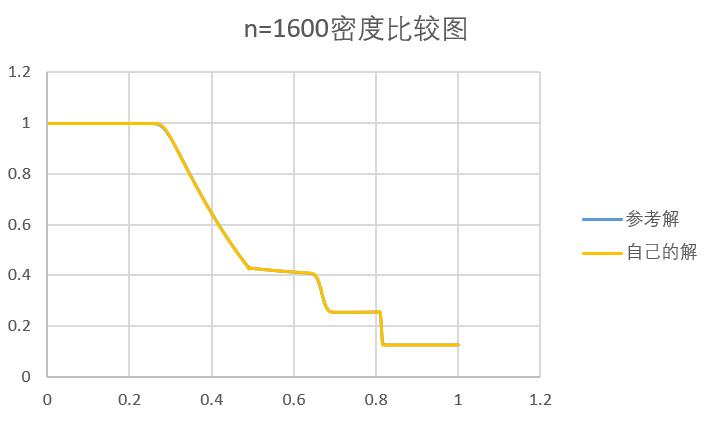

<center><font size="6"><b>CFD作业5</b></font></center>

<center><font size="3"><b>林文浩 PB21050974</b></font></center>

#### 背景

激波管是一种用于研究和产生激波现象的气体动力学设备。它由一根长管道组成，通过控制高压气体的释放，产生激波并观察其传播行为。激波管在航空航天、气动力学和爆炸物理学等领域有广泛应用，帮助改善飞行器设计和理解激波现象。现代激波管利用先进技术实现精确实验操作和数据记录，成为不可或缺的研究工具。

在流体力学领域中常使用数值计算方法来模拟和分析高速气体流动中的激波现象。它基于欧拉方程组，通过数值求解来模拟激波传播、压力变化和流场演化。激波管计算在航空航天、工程设计和物理研究等领域有广泛应用，可以预测激波的传播和相互作用，优化设计参数，提高飞行器性能和安全性。它是研究高速气体流动和激波现象的重要工具，对理论研究和实验验证提供重要支持。

#### 计算的原理和方法

__题目：__

求解如下图变截面拟一维激波管问题

<center class = "half">
    
</center>

控制方程（拟一维欧拉方程）可表示为：

$$\frac{\partial (\rho A)}{\partial t} + \frac{\partial (\rho u A)}{\partial x} = 0$$

$\frac{\partial (\rho u A)}{\partial t} + \frac{\partial \left[(\rho u^2 + p)A\right]}{\partial x} = p \frac{\partial A}{\partial x}$ 

$\frac{\partial (\rho E A)}{\partial t} + \frac{\partial \left[(\rho E + p)u A\right]}{\partial x} = 0$

其中，$ρ, u, E$ 分别为密度、水平速度和比总能。$A$ 为管道截面积，管道上下壁面分别为由 $C_2$和 $C_1$表示。$C_1$和 $C_2$为圆弧，半径都为$2$，圆心坐标分别为$(0.5, - 1.6)$和$(0.5,2.6)$

初始条件：

$ρ_L = 1,p_L = 1, u_L = 0 ,ρ_R = 0.125 ,p_R = 0.1 ,u_R = 0$

__原理__

通过将控制方程组改写成如下形式，可以将变截面问题转化为定截面问题

$$\frac{\partial (\rho )}{\partial t} + \frac{\partial (\rho u )}{\partial x} = -\frac{\rho u}{A}\frac{\partial A}{\partial x}$$

$\frac{\partial (\rho u )}{\partial t} + \frac{\partial (\rho u^2 + p)}{\partial x} = -\frac{\rho u^2+p}{A}\frac{\partial A }{\partial x}+\frac{p}{A} \frac{\partial A}{\partial x}=-\frac{\rho u^2}{A}\frac{\partial A }{\partial x}$ 

$\frac{\partial  E }{\partial t} + \frac{\partial \left[( E + p)u \right]}{\partial x} = -\frac{(E+p)}{A}\frac{\partial A }{\partial x}$

因此原本近似黎曼求解器时的

$U_{j}^{n+1}=U_{j}^{n}-\frac{\Delta t}{\Delta x}[F_{j+\frac12}-F_{j-\frac12}]$

变为

$U_{j}^{n+1}=U_{j}^{n}-\frac{\Delta t}{\Delta x}[\bar F_{j+\frac12}-\bar F_{j-\frac12}]+\Delta t\times R_j$

其中$U=(\rho,\rho u,E)^T,R=(-\frac{\rho u}{A}\frac{\partial A}{\partial x},-\frac{\rho u^2}{A}\frac{\partial A }{\partial x},-\frac{(E+p)}{A}\frac{\partial A }{\partial x})^T$ 

 而当使用Roe格式时，其数值通量$\bar F$的计算方式与一维时相同

具体计算$\bar F_{j+\frac12}$过程为：

1.求Roe平均量

$\bar{\rho} = \sqrt{\rho_L}  \sqrt{\rho_R}$

$\bar{u} = \frac{\sqrt{\rho_L} u_L + \sqrt{\rho_R} u_R}{\sqrt{\rho_L} + \sqrt{\rho_R}}$

$\bar{h} = \frac{\sqrt{\rho_L} h_L + \sqrt{\rho_R} h_R}{\sqrt{\rho_L} + \sqrt{\rho_R}}$

$\bar{a}=\sqrt{(\gamma-1)(\bar h-\frac12\bar{u}^2)}$（有些资料里声速$a$写作$c$）

2.求特征值

$\lambda_1=|\bar u|$

$\lambda_2=|\bar u+\bar a|$

$\lambda_3=|\bar u-\bar a|$

3.求特征向量（注意这里的$R$和控制方程里的不是同一个东西）

$R_1=(1,\bar u,\frac12\bar u^2)$

$R_2=(1,\bar u+\bar a,\bar h+\bar u\cdot\bar a)\cdot(\bar \rho/(2\bar a))$

$R_3=(1,\bar u-\bar a,\bar h-\bar u\cdot\bar a)\cdot(-\bar \rho/(2\bar a))$

4.求幅值

$w_1 =\Delta\rho-\Delta p/\bar a^2$

$w2=\Delta u+\Delta p/(\bar\rho\cdot\bar a)$

$w3=\Delta u-\Delta p/(\bar\rho\cdot\bar a)$

5.求通量

$\bar F_{j+\frac12}(1)=\frac12[F_{j+1}(1)+F_{j}(1)]-\frac12(\lambda_iw_iR_i(1))$

$\bar F_{j+\frac12}(2)=\frac12[F_{j+1}(2)+F_{j}(2)]-\frac12(\lambda_iw_iR_i(2))$

$\bar F_{j+\frac12}(3)=\frac12[F_{j+1}(3)+F_{j}(3)]-\frac12(\lambda_iw_iR_i(3))$

最后将$\bar F$带入迭代方程求解就能得出激波管问题的近似解

#### 结果与讨论

##### 一、200、400、800、1600网格下参考解与自己的解的比较图

<center class = "half">
    
    
</center>

<center class = "half">
    
    
</center>

<center class = "half">
    
    
</center>

<center class = "half">
    
    
</center>

<center class = "half">
    
    
</center>

<center class = "half">
    
    
</center>

可以发现，当网格数较少时，与参考解偏离较大，特别是在曲线的尖锐拐角处，存在较大偏差，而当网格达到1600时，肉眼已经无法看出与参考解的偏差。

##### 二、选取网格数为 1600 的结果为基准解，画出误差随网格间距的变化情况(作出 log-log 图)，观察线性情况。

<center class = "half">
    


</center>

可以发现，误差随间距的变化大致成线性

#### 源代码

shock_tube.m

~~~matlab
function [x, rho, u, p] = shock_tube(nx)
    % 参数设置
    % nx = 1600; % 网格数
    L = 1.0; % 管道长度
    dx = L / nx; % 网格间距
    x = linspace(0, L, nx); % 网格点坐标
    t_end = 0.18; % 终止时间
    dt = 0.0001; % 时间步长
    gamma = 1.4; % 比热比

    % 初始条件
    rho = ones(1, nx) * 0.125;
    u = zeros(1, nx);
    p = ones(1, nx) * 0.1;
    rho(1:round(nx / 2)) = 1.0;
    p(1:round(nx / 2)) = 1.0;

    %用于迭代时临时存放数据
    rho_copy = ones(1, nx);
    u_copy = zeros(1, nx);
    E_copy = zeros(1, nx);

    % 计算初始总能
    E = p / (gamma - 1) + 0.5 * rho .* u .^ 2;

    % 时间推进
    t = 0;

    while t < t_end
        % Roe格式计算通量
        [F1, F2, F3] = roe_flux(rho, u, p, E, gamma, nx);
        [R1, R2, R3] = R(rho, u, p, E, nx, x, dx);

        % 更新变量
        rho_copy(2:end - 1) = rho(2:end - 1) - dt / dx * (F1(2:end - 1) - F1(1:end - 2)) + dt * R1(2:end - 1);
        u_copy(2:end - 1) = (rho(2:end - 1) .* u(2:end - 1) - dt / dx * (F2(2:end - 1) - F2(1:end - 2)) + dt * R2(2:end - 1)) ./ rho_copy(2:end - 1); %注意这个除数需要是新的值
        E_copy(2:end - 1) = E(2:end - 1) - dt / dx * (F3(2:end - 1) - F3(1:end - 2)) + dt * R3(2:end - 1);
        p = (gamma - 1) * (E - 0.5 * rho .* u .^ 2);
        rho(2:end - 1) = rho_copy(2:end - 1);
        u(2:end - 1) = u_copy(2:end - 1);
        E(2:end - 1) = E_copy(2:end - 1);

        % 更新时间
        t = t + dt;
    end

end

function [F1, F2, F3] = roe_flux(rho, u, p, E, gamma, nx)
    % 计算通量
    F1 = rho .* u;
    F2 = rho .* u .^ 2 + p;
    F3 = (E + p) .* u;

    % 计算Roe平均量
    for i = 1:nx - 1
        % 左右状态
        rhoL = rho(i); rhoR = rho(i + 1);
        uL = u(i); uR = u(i + 1);
        pL = p(i); pR = p(i + 1);

        % Roe平均量
        rL = sqrt(rhoL); rR = sqrt(rhoR);
        rhoRoe = rL * rR;
        uRoe = (rL * uL + rR * uR) / (rL + rR);
        hL = (gamma * pL) / ((gamma - 1) * rhoL);
        hR = (gamma * pR) / ((gamma - 1) * rhoR);
        hRoe = (rL * hL + rR * hR) / (rL + rR);
        aRoe = sqrt((gamma - 1) * (hRoe - 0.5 * uRoe ^ 2));

        % Differences
        delta_rho = rhoR - rhoL;
        delta_u = uR - uL;
        delta_p = pR - pL;

        % 特征值
        lambda1 = abs(uRoe);
        lambda2 = abs(uRoe + aRoe);
        lambda3 = abs(uRoe - aRoe);

        % 特征向量
        R1 = [1, uRoe, (uRoe ^ 2) / 2];
        R2 = [1, uRoe + aRoe, hRoe + uRoe * aRoe] * (rhoRoe / 2 / aRoe);
        R3 = [1, uRoe - aRoe, hRoe - uRoe * aRoe] * (-rhoRoe / 2 / aRoe);

        % 幅值
        w1 = delta_rho - delta_p / (aRoe ^ 2);
        w2 = delta_u + delta_p / (rhoRoe * aRoe);
        w3 = delta_u - delta_p / (rhoRoe * aRoe);

        % 通量
        F1_half = 0.5 * (F1(i) + F1(i + 1)) - 0.5 * (lambda1 * w1 * R1(1) + lambda2 * w2 * R2(1) + lambda3 * w3 * R3(1));
        F2_half = 0.5 * (F2(i) + F2(i + 1)) - 0.5 * (lambda1 * w1 * R1(2) + lambda2 * w2 * R2(2) + lambda3 * w3 * R3(2));
        F3_half = 0.5 * (F3(i) + F3(i + 1)) - 0.5 * (lambda1 * w1 * R1(3) + lambda2 * w2 * R2(3) + lambda3 * w3 * R3(3));

        % 更新通量
        F1(i) = F1_half;
        F2(i) = F2_half;
        F3(i) = F3_half;
    end

end

function [R1, R2, R3] = R(rho, u, p, E, nx, x, dx)

    A = 4.2 - 2 .* sqrt(4 - (x - 0.5) .^ 2);
    dA = zeros(1, nx);

    for i = 2:nx - 1
        dA(i) = (A(i) - A(i - 1)) / dx;
    end

    % 计算通量
    R1 = -rho .* u .* dA ./ A;
    R2 =- (rho .* (u .^ 2)) .* dA ./ A;
    R3 =- (E + p) .* u .* dA ./ A;

end

~~~

plotSolution.m

~~~matlab
clear;
clc;

[x,rho, u, p] = shock_tube(1600);

% 绘制结果
figure;
subplot(3, 1, 1);
plot(x, rho);
title('Density');
subplot(3, 1, 2);
plot(x, u);
title('Velocity');
subplot(3, 1, 3);
plot(x, p);
title('Pressure');
~~~

error_analysis.m

```matlab
clear;
clc;

[x_ref, rho_ref, u_ref, p_ref] = shock_tube(1600);

d_log = zeros(1, 1);
error_log = zeros(1, 1);
m_error=0;

for i = 1:8
    n = 100 * i;
    [x, rho, u, p] = shock_tube(n);

    times = 1600 / n;

    rho_ = zeros(n, 1);
    u_ = zeros(n, 1);
    p_ = zeros(n, 1);

    for j = 1:n
        rho_(j) = rho_ref(floor(times * j));
        u_(j) = u_ref(floor(times * j));
        p_(j) = p_ref(floor(times * j));
    end

    %计算误差积分
    for j = 1:n
        m_error = m_error + (rho(j) - rho_(j)) ^ 2;
    end

    m_error = m_error / n;

    d_log(i) = log10(1/n);
    error_log(i) = log10(m_error);

end

plot(d_log, error_log);
xlabel('log_{10}(d)');
ylabel('log_{10}(error)');
title('误差随网格间距变化');

% % 指定Excel文件路径和文件名
% filename = 'D:/QQ消息记录等数据/757001674/FileRecv/参考解.xlsx';
% rho_ref = readmatrix(filename, 'Range', 'B2:B201');
% u_ref = readmatrix(filename, 'Range', 'C2:C201');
% p_ref = readmatrix(filename, 'Range', 'D2:D201');

```

