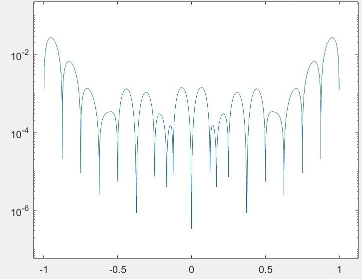
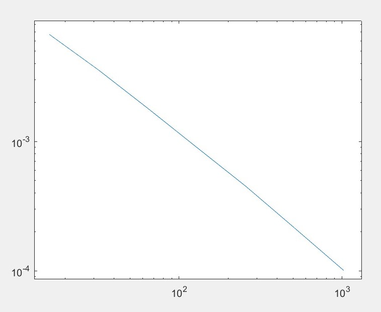
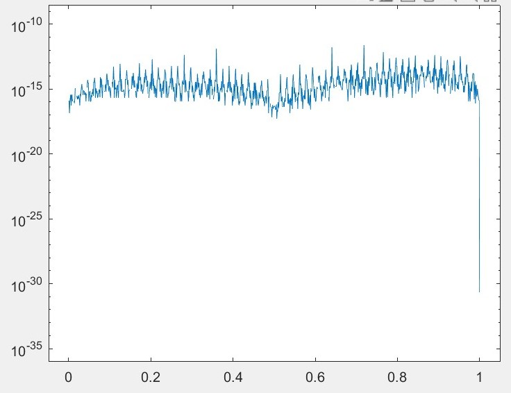
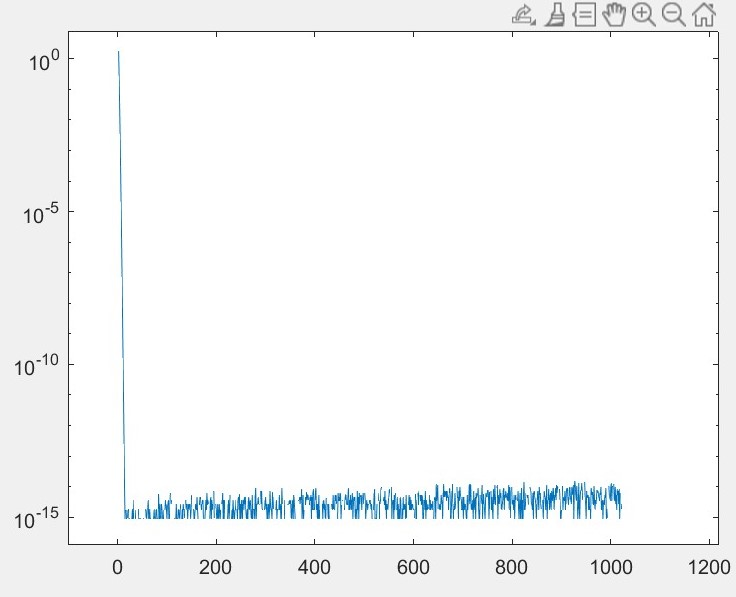
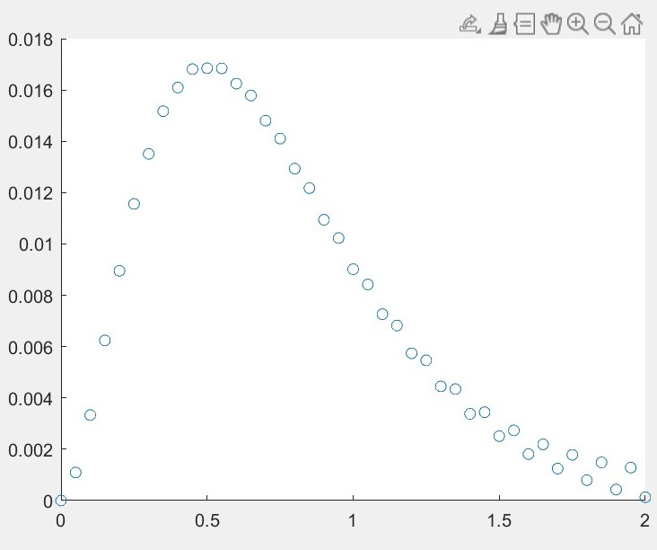
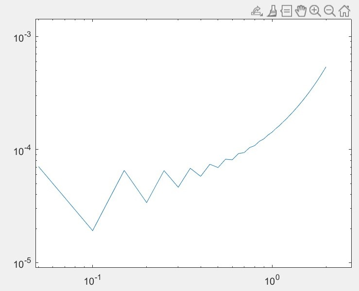

# 计算方法大作业

__林文浩 PB21050974__

## 第一题

#### （b）

~~~matlab
%{
    f(x)定义在[-1,1]上
    求用节点处二阶导数M表示的三次样条插值函数，令S'(-1) = S'(1) = 0
    采用等距插值
    最终得到等距测试点v上的逐点误差，画出散点图
%} 

%解各内部插值点二次导数值满足的线性方程组A * M = F
n = 2^4;%区间数
h = 2/n;%步长
x = -1:h:1;
y = sin(4 * (x .^ 2)) + (sin(4 * x) .^ 2);
f = @(x)sin(4 * (x .^ 2)) + (sin(4 * x) .^ 2);

A = eye(n+1) * 2;
%M = zeros(n+1,1);%不用预分配，等会会直接创建
F = zeros(n+1,1);

A(1,1) = 2;
A(1,2) = 1;
for i = 2:n
    A(i,i-1) = 0.5;
    A(i,i+1) = 0.5;
end
A(n+1,n) = 1;
A(n+1,n+1) = 2;

F(1) = 6 * (y(2) - y(1)) / h^2; 
for i = 2:n
    F(i) = 3 * (y(i+1) - (2 * y(i)) + y(i-1)) / (h^2);
end
F(n+1) = -6 * (y(n+1) - y(n)) / h^2;

M = A\F;
%{
这段代码画出原函数和插值函数的对比图，用于检查是否插值成功

fplot(f,[-1 1],'r')
hold on
for i = 2:n+1
    S = @(s)(1 / (6 * h)) * ((x(i) - s).^3 * M(i-1) + (s - x(i-1)).^3 * M(i) ...
     + (6 * y(i-1) - M(i-1) * h^2) * (x(i) - s) + (6 * y(i) - M(i) * h^2) * (s - x(i-1)));
    fplot(S,[x(i-1) x(i)],'b')
end
hold off

%} 

%S{1,n+1} = @(z)0;%不知道为什么这样子预分配元胞数组的话，后面会出错
S = cell(1,n+1);%元胞数组，用来存每段多项式函数句柄（注意S(1)没用到，这是因为matlab奇怪的从1开始的下标导致的）
for i = 2:n+1
    S{i} = @(s)(1 / (6 * h)) * ((x(i) - s).^3 * M(i-1) + (s - x(i-1)).^3 * M(i) ...
     + (6 * y(i-1) - M(i-1) * h^2) * (x(i) - s) + (6 * y(i) - M(i) * h^2) * (s - x(i-1)));
end

d = 2000;%等距节点数
v = linspace(-1,1,d);%等距节点
error = zeros(1,d);
error(d) = 0;
segment = 2;%用于指示现在用到第几个S了
for i = 1:d
    if v(i) <= x(segment)
        error(i) = S{segment}(v(i)) - f(v(i));
    else
        segment = segment + 1;
        error(i) = S{segment}(v(i)) - f(v(i));
    end
end

%scatter(v, error);%逐点误差线性散点图
semilogy(v,abs(error));%逐点误差半对数图散点图

~~~

逐点误差展示图

#### （c）

~~~matlab
%{
    在（b）的基础上，令插值区间n不断增大，画出最大误差随n的变化
%} 

%这俩不能放循环内，否则每次循环都会把之前存的值清空
error_max = zeros(1,10);%对应不同n=2^k下的最大误差
x_axis = zeros(1,10);%用于存放画图用的横坐标

for k = 4:10
    n = 2 ^ k;%区间数
    h = 2 / n; %步长
    x = -1:h:1;
    y = sin(4 * (x .^ 2)) + (sin(4 * x) .^ 2);
    f = @(x)sin(4 * (x .^ 2)) + (sin(4 * x) .^ 2);

    A = eye(n + 1) * 2;
    %M = zeros(n+1,1);%不用预分配，等会会直接创建
    F = zeros(n + 1, 1);

    A(1, 1) = 2;
    A(1, 2) = 1;

    for i = 2:n
        A(i, i - 1) = 0.5;
        A(i, i + 1) = 0.5;
    end

    A(n + 1, n) = 1;
    A(n + 1, n + 1) = 2;

    F(1) = 6 * (y(2) - y(1)) / h ^ 2;

    for i = 2:n
        F(i) = 3 * (y(i + 1) - (2 * y(i)) + y(i - 1)) / (h ^ 2);
    end

    F(n + 1) = -6 * (y(n + 1) - y(n)) / h ^ 2;

    M = A \ F;

    S = cell(1, n + 1); %元胞数组，用来存每段多项式函数句柄

    for i = 2:n + 1
        S{i} = @(s)(1 / (6 * h)) * ((x(i) - s) .^ 3 * M(i - 1) + (s - x(i - 1)) .^ 3 * M(i) ...
            + (6 * y(i - 1) - M(i - 1) * h ^ 2) * (x(i) - s) + (6 * y(i) - M(i) * h ^ 2) * (s - x(i - 1)));
    end

    d = 2000; %等距节点数
    v = linspace(-1, 1, d); %等距节点
    error = zeros(1, d);
    error(d) = 0;
    segment = 2; %用于指示现在用到第几个S了
    for i = 1:d

        if v(i) <= x(segment)
            error(i) = S{segment}(v(i)) - f(v(i));
        else
            segment = segment + 1;
            error(i) = S{segment}(v(i)) - f(v(i));
        end
        if error(i) > error_max(k)
            error_max(k) = error(i);
        end
    end

    %scatter(v, error);%逐点误差线性散点图
    %semilogy(v, abs(error)); %逐点误差半对数图散点图

    x_axis(k) = 2^k;
end
%scatter(x_axis(4:10), error_max(4:10));
loglog(x_axis(4:10), error_max(4:10));

~~~

最大误差随n变化图：

## 第二题

~~~matlab
%{
    [0,1]上周期函数基于等距节点的拉格朗日插值
%} 
n = 2^6;%区间数
x = 0:1/n:(n-1)/n;

f = @(a) sin(2*pi*a) .* exp(cos(2*pi*a));
y = f(x);

S = cell(1,n);%元胞数组，用来存放基函数,注意S(i)里面放的是l_(i-1)
for i = 1:n
    k = i - 1;
    if mod(n,2) == 1
        S{i} = @(s)(-1)^k * sin(n*pi*s) .* csc(pi*(s - k/n)) / n;
    else
        S{i} = @(s)(-1)^k * sin(n*pi*s) .* cot(pi*(s - k/n)) / n;
    end
end

d = 1000;%等距节点数
v = linspace(0,1,d);%等距节点
result = zeros(1,d);%存放插值函数算出的结果
error = zeros(1,d);
real_value = zeros(1,d);%保存测试点的真实值，用于与result比较，检查插值是否正确

for i = 1:d
    for j = 1:n
        result(i) = result(i) + S{j}(v(i)) * y(j);
    end
    error(i) = result(i) - f(v(i));
    real_value(i) = f(v(i));
end

%{
    分别画出真值和拟合值的散点图，用于debug时检查正确性
scatter(v, result);
hold on
scatter(v, real_value);
hold off
%}
semilogy(v, abs(error));

~~~

误差随x变化图：

## 第三题

~~~matlab
f = @(a) exp(cos(a));
real_value = integral(f,-pi,pi);
result = zeros(2^10-1);
error = zeros(2^10-1);

for m = 2:2 ^ 10 %子区间数量
    h = 2 * pi / m; %步长
    x = linspace(-pi, pi, m + 1);
    y = f(x);

    result(m - 1) = h / 2 * (f(-pi) + f(pi));

    for i = 1:m - 1
        result(m - 1) = result(m - 1) + h * f(-pi + i * h);
    end

    error(m - 1) = result(m - 1) - real_value;
end
semilogy(2:2 ^ 10, abs(error));

~~~

积分精度随m变化图：

## 第四题

~~~matlab
%{
    使用线性多步法求初值问题y'=xe^(-4x)-4y         y(0) = 0
    采用公式格式为y(n+1) = y(n-1) + [1/3f(n+1) + 4/3f(n) + 1/3f(n-1)]*h       二步方法，只需要再额外一个出发值
    先由二阶的Runge_Kutta法求出出发值
    虽然是隐式公式，但是由于f比较特殊可以改为显式公式y(i+1) = (y(i-1) + h/3*(x(i+1)*exp(-4*x(i+1))) + 4*h/3*f(x(i),y(i)) + h/3*f(x(i-1),y(i-1)))/(1 + 4*h/3)
%} 
h = 0.05;
f = @(a,b) a * exp(-4*a) - 4 * b;
x = 0:h:2;%注意x(1)其实是x0
y(41) = 0;%预分配内存
y(1) = 0;
y(2) = 0.00109396;%由R-K得到的出发值
%y(3) = 0.00935703;
for i = 2:40
    y(i+1) = (y(i-1) + h/3*(x(i+1)*exp(-4*x(i+1))) + 4*h/3*f(x(i),y(i)) + h/3*f(x(i-1),y(i-1)))/(1 + 4*h/3);
end

y_real_value = 0.5 * x.^2 .* exp(-4*x);%精确解，可用来对比

%这段用来对比精确解函数图像和解函数图像
scatter(x, y);
hold on
scatter(x, y_real_value);
hold off

%这段用loglog来判断阶数，这段和上面那段得分开运行，不能同时运行
error = abs(y - y_real_value);
loglog(x,error);
~~~

解函数图像：

loglog图：

